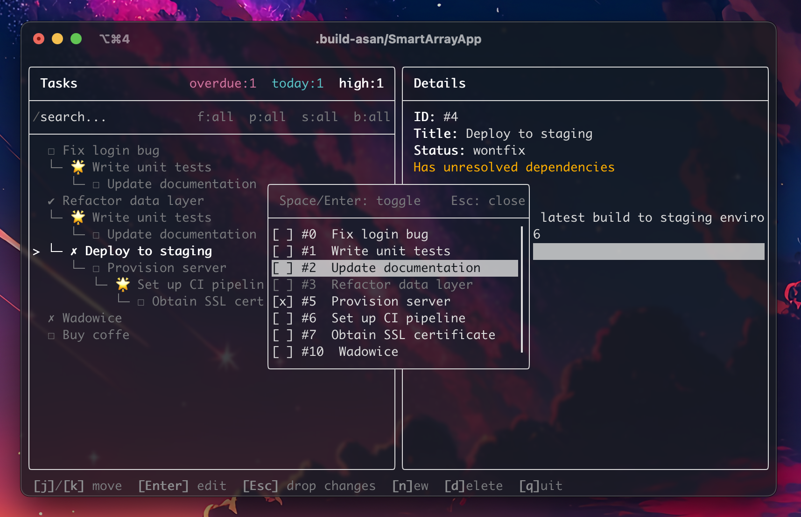

# todo-app

Terminal-based task manager with dependency tracking. Tasks can block other tasks, forming a DAG. The TUI shows a tree view of the dependency graph with search, filtering, and stats.

Built in C++ using [ftxui](https://github.com/ArthurSonzogni/ftxui). Data persisted to a binary file.




## Features

- Create/edit/delete tasks with title, description, priority, status, due date
- Block tasks on other tasks (cycle detection prevents invalid deps)
- Tree view of the dependency graph with 3 view modes
- Search by title, filter by status/priority/date range
- Aggregate stats (overdue, due today, high-priority counts)
- Optional CLI arg to specify save file path (default: `tasks.bin` next to the binary)


## Navigation

Vim motions, Arrow keys, Mouse — all work simultaneously

- **Move up/down** — `j`/`k`, `Tab`, Arrow keys, or Mouse click
- **Jump to top/bottom** — `g`/`G`
- **Select / confirm** — `Enter`, `Space` or Mouse click on field
- **Back / cancel** — `Esc` or Mouse click outside of field
- **Switch panes** — `h`/`l`, `Enter`/`Esc` or Mouse click on pane


## Requirements

- C++17 compiler (GCC/Clang/MSVC)
- CMake 3.20+
- Internet access on first build (fetches ftxui and GTest)


## Build & Run

**Release mode**

optimised compilation (`-O2`, `assert()` disabled, no debug symbols)

```sh
# initial setup (first time only)
mkdir .release
cmake -S . -B .release -DCMAKE_BUILD_TYPE=Release

# build app
cmake --build .release

# run app
.release/todo-app [file]
```

**Development mode**

no optimisation, ASAN enabled (detects memory errors: use-after-free, buffer overflow, leaks)

> does not use -fprofile-arcs or -ftest-coverage

> ASAN flags are GCC/Clang only — Debug build will not compile on MSVC

```sh
# initial setup (first time only)
mkdir .debug
cmake -S . -B .debug -DCMAKE_BUILD_TYPE=Debug

# build app & tests
cmake --build .debug

# run app
.debug/todo-app [file]

# run tests (single file)
.debug/tests/<test-file> --gtest_brief=1

# run all tests
ctest --test-dir .debug/tests | tail -4
```

First build will fetch FTXUI and GTest from the internet.


## Academic Context

This project was overengineered for the `Programming Languages and Paradigms` CS class :)

**Assignment requirements**
- [docs/appRequirements.md (Polish)](docs/appRequirements.md)
- [docs/smartArrayRequirements.md (Polish)](docs/smartArrayRequirements.md)

**`SmartArray<T>`** (`src/smartArray/`) — custom `std::vector` implementation required by the class
- hand-written dynamic array
- fully RAII-compliant (Rule of 5)
